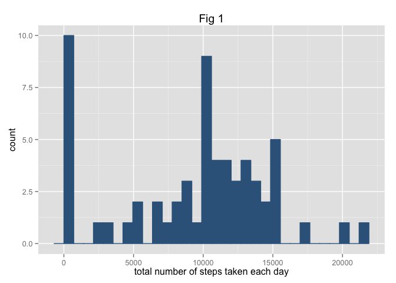
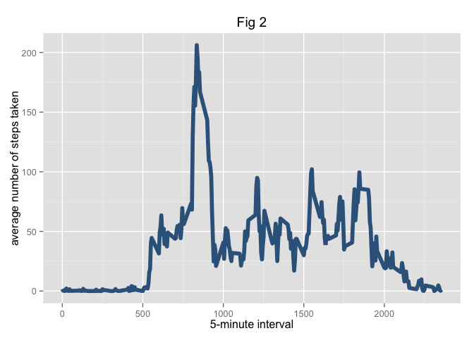
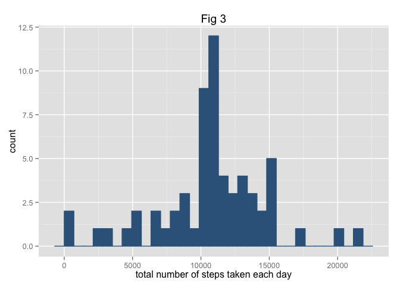
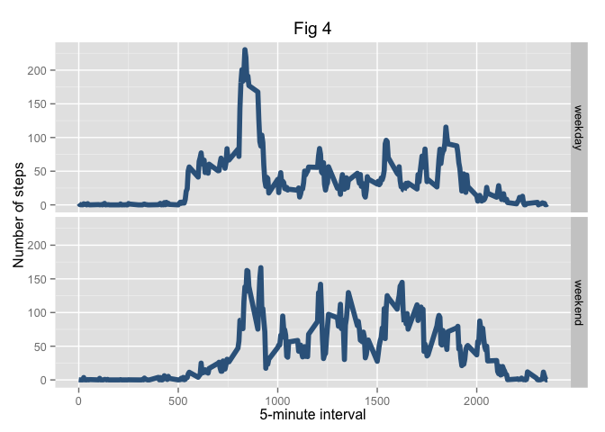

# Reproducible Research: Peer Assessment 1


## Loading and preprocessing the data
#Load the data

```r
library(data.table)
DT <- data.table(read.csv("activity.csv"))
```


## What is mean total number of steps taken per day?

```r
library(ggplot2)
total.steps <- tapply(DT$steps, DT$date, FUN=sum, na.rm=TRUE)
#histogram of the total number of steps taken each day
qplot(total.steps, binwidth=3, xlab="total number of steps taken each day", main="Fig 1")+ geom_histogram(colour="steelblue4", fill="steelblue4")
```

```
## stat_bin: binwidth defaulted to range/30. Use 'binwidth = x' to adjust this.
```

 

```r
#mean total number of steps taken per day
mean(total.steps, na.rm=TRUE)
```

```
## [1] 9354.23
```

```r
#median total number of steps taken per day
median(total.steps, na.rm=TRUE)
```

```
## [1] 10395
```
Average (Mean) number of steps per day is **9354.23**

The median number of steps per day is **10,395**


## What is the average daily activity pattern?
Time series plot of the 5-minute interval (x-axis) and the average number of steps taken, averaged across all days


```r
library(ggplot2)
averages <- aggregate(x=list(steps=DT$steps), by=list(interval=DT$interval), FUN=mean, na.rm=TRUE)
ggplot(data=averages, aes(x=interval, y=steps)) +geom_line(color = "steelblue4", lwd = 2) + xlab("5-minute interval") + ylab("average number of steps taken")+ labs(title = expression("Fig 2"))
```

 

On average across all the days in the dataset, the 5-minute interval contains
the maximum number of steps?

```r
averages[which.max(averages$steps),]
```

```
##     interval    steps
## 104      835 206.1698
```

The 5-minute interval that contains the maximum averaged number of steps is 8:35 am (**835**).  The maximum averaged number of steps is **206.1698**


## Imputing missing values

```r
missing <- is.na(DT$steps)
# total number of missing values in the dataset
table(missing)
```

```
## missing
## FALSE  TRUE 
## 15264  2304
```

A new dataset is created with all of the missing values are filled in with mean value for that 5-minute interval.


```r
# Replace each missing value with the mean value of its 5-minute interval
fill.value <- function(steps, interval) {
    filled <- NA
    if (!is.na(steps))
        filled <- c(steps)
    else
        filled <- (averages[averages$interval==interval, "steps"])
    return(filled)
}
filled.DT <- DT
filled.DT$steps <- mapply(fill.value, filled.DT$steps, filled.DT$interval)
```


```r
#histogram with new dataset
total.steps <- tapply(filled.DT$steps, filled.DT$date, FUN=sum)
qplot(total.steps, binwidth=3, xlab="total number of steps taken each day", main="Fig 3") + geom_histogram(colour="steelblue4", fill="steelblue4")
```

```
## stat_bin: binwidth defaulted to range/30. Use 'binwidth = x' to adjust this.
```

 

```r
#mean total number of steps taken per day
mean(total.steps)
```

```
## [1] 10766.19
```

```r
#median total number of steps taken per day
median(total.steps)
```

```
## [1] 10766.19
```

Average (Mean) number of steps per day is **10766.19**

The median number of steps per day is **10766.19**


## Are there differences in activity patterns between weekdays and weekends?
In order to find the day of the week for each measurement in the dataset, the following function is used.


```r
weekday.or.weekend <- function(date) {
    day <- weekdays(date)
    if (day %in% c("Monday", "Tuesday", "Wednesday", "Thursday", "Friday"))
        return("weekday")
    else if (day %in% c("Saturday", "Sunday"))
        return("weekend")
    else
        stop("invalid date")
}
filled.DT$date <- as.Date(filled.DT$date)
filled.DT$day <- sapply(filled.DT$date, FUN=weekday.or.weekend)
```

Panel plot containing plots of average number of steps taken on weekdays and weekends.


```r
averages <- aggregate(steps ~ interval + day, data=filled.DT, mean)
ggplot(averages, aes(interval, steps)) + geom_line(color = "steelblue4", lwd = 2) + facet_grid(day ~ .) +
    xlab("5-minute interval") + ylab("Number of steps") + labs(title = expression("Fig 4"))
```

 
